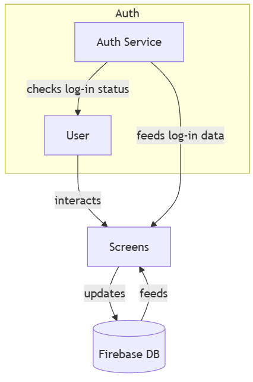

# isdex

## Logical View Diagram


## Flow Description
**1. Auth Service** monitors the authentication state and checks log-in status of the User.

**2. Auth Service** concurrently **feeds log-in data** (such as the User UID and User Object) **directly to the Screens** to manage access control.

**3.** The **User** triggers an event by interacting with a specific Screen (e.g., adding a new fish sighting).

**4.** The **Screen directly updates the Firebase DB** by pushing new data to a specific node (e.g., user_sightings_temp).

**5.** The **Firebase DB** utilizes a persistent connection to **feed real-time data** updates back to the **Screens**.

**6.** The **Screen listens to this stream**, processes the raw data into **Marker** objects, and refreshes the map display for the user.

# Software Architecture

### Current Pattern: Smart UI

The current system follows a **Smart UI** pattern. There is no formal separation between the UI layer and the business logic layer. Flutter Screen widgets (e.g., `landing_page.dart`) are responsible for:

- Directly calling Firebase Authentication and Realtime Database
- Listening to and transforming live data streams
- Processing raw Firebase snapshots into model objects (e.g., `Marker`)
- Managing local state and controlling UI visibility based on auth state

This pattern is common in early-stage Flutter apps because Firebase's reactive SDKs make it easy to wire everything directly into widgets. However, as the application grows, this leads to bloated widget files, untestable logic, and difficulty onboarding new contributors.

### Target Pattern: MVVM (Model-View-ViewModel)

The system is being refactored toward an **MVVM (Model-View-ViewModel)** architecture, a pattern widely adopted in Flutter and other reactive UI frameworks. It separates the application into three distinct layers:

| Layer | Role |
|---|---|
| **Model** | Represents app data as plain Dart objects. No UI, no Firebase logic. |
| **View** | Renders UI widgets. Observes and reacts to ViewModel state. No business logic. |
| **ViewModel** | Holds UI state, applies business logic, and communicates directly with Firebase. |

This pattern is appropriate for isdex because the app has clear data-driven screens (map, sighting form, profile), real-time streams that need centralized state management, and authentication logic that should not bleed into individual widgets.

---


## Project Structure

The structure below reflects the **planned project structure** after refactoring to MVVM + Repository. Each folder maps directly to a layer or role in the architecture.

```
isdex/
├── android/                        # Android platform files
├── ios/                            # iOS platform files
├── assets/                         # Images, icons, fonts
│
└── lib/
    ├── main.dart                   # App entry point, initializes Firebase
    │
    ├── app/
    │   ├── app.dart                # Root widget, MaterialApp setup
    │   └── router.dart             # Named route definitions and auth guards
    │
    ├── models/                     # ── MODEL LAYER ──────────────────────────
    │   ├── sighting.dart           # Sighting data class (fromMap, toMap)
    │   ├── fish.dart               # Fish species data class
    │   └── app_user.dart           # User profile data class
    │
    ├── viewmodels/                 # ── VIEWMODEL LAYER ──────────────────────
    │   ├── auth_viewmodel.dart     # Auth state, login/logout, Firebase Auth calls
    │   ├── map_viewmodel.dart      # Marker list state, sighting filters, DB stream
    │   ├── sighting_viewmodel.dart # Form state, submission logic, DB write
    │   └── profile_viewmodel.dart  # User profile state, DB read/write
    │
    ├── views/                      # ── VIEW LAYER ───────────────────────────
    │   ├── auth/
    │   │   ├── login_screen.dart   # Login form UI
    │   │   └── register_screen.dart# Registration form UI
    │   ├── map/
    │   │   ├── map_screen.dart     # Main map display
    │   │   └── sighting_sheet.dart # Bottom sheet for sighting details
    │   ├── sighting/
    │   │   └── add_sighting_screen.dart # New sighting form UI
    │   └── profile/
    │       └── profile_screen.dart # User profile UI
    │
    └── core/                       # ── SHARED / CROSS-CUTTING ───────────────
        ├── constants/
        │   └── firebase_nodes.dart # Firebase DB node name constants
        └── widgets/
            ├── loading_spinner.dart# Reusable loading indicator
            └── error_banner.dart   # Reusable error display widget
```

### Folder-to-Pattern Mapping

| Folder | MVVM Role | Description |
|---|---|---|
| `models/` | **Model** | Plain Dart objects representing app data. No logic, no Firebase. |
| `viewmodels/` | **ViewModel** | State holders using `ChangeNotifier` or `Riverpod`. Own all Firebase calls and business logic. |
| `views/` | **View** | Flutter widgets only. Read state from ViewModels and dispatch user events to them. |
| `core/constants/` | **Shared Config** | Centralizes Firebase node strings to avoid magic strings scattered across ViewModels. |
| `core/widgets/` | **Shared UI** | Reusable UI components not tied to any specific screen. |
| `app/` | **App Shell** | Entry configuration, routing, and auth-based navigation guards. |