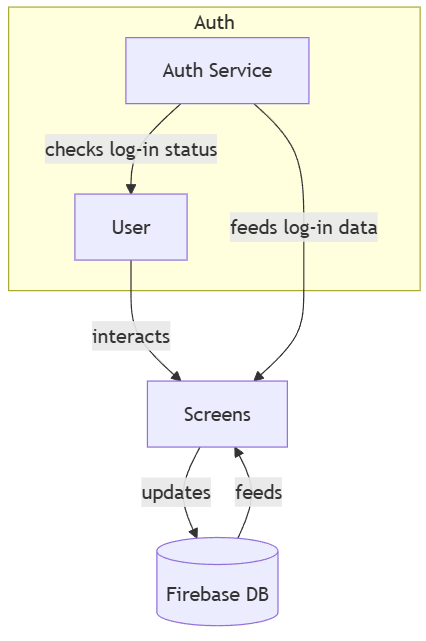

# IsDex

IsDex is a Flutter application for exploring Philippine fish species, viewing known fish distribution areas, recording user-submitted sightings, and asking an AI assistant about fish identification and local species information.

The app uses Firebase Authentication and Firebase Realtime Database for accounts, catalog data, sightings, community content, and chat history. It follows an MVVM-style architecture with Providers, ViewModels, Repositories, and Services to keep UI code separate from data access and app logic.

## Features

- Fish species catalog with common name, scientific name, local name, habitat, size range, images, identifying features, distribution, and conservation details.
- Search and habitat filtering for browsing species.
- Fish detail pages with map navigation and IUCN Red List lookup support.
- Photo-based fish search using Google ML Kit image labeling, with manual search fallback.
- Reference fish map built with `flutter_map`, `latlong2`, and OpenStreetMap tiles.
- User sightings map with GPS location capture, fish selection, notes, anonymous posting, pending approval state, deletion for owners, and reporting for inaccurate pins.
- Geo-validation of submitted sightings using OpenStreetMap Nominatim reverse geocoding.
- Community feed with image posts, captions, likes, comments, reports, and deletion support.
- Gemini-powered IsDex AI Assistant with selectable Gemini models, fish-context injection from the catalog, quota fallback handling, Markdown responses, and saved chat history.
- Firebase-backed authentication with sign in, sign up, password reset, role loading, and route guards.
- Internal admin/moderator screens for sightings moderation, reported posts, fish data management, archived fish restoration, and user role management.

## Logical View Diagram



## Architecture

The current codebase is organized around MVVM plus Repository and Service layers.

| Layer | Main folders | Responsibility |
| --- | --- | --- |
| App shell | `lib/app/` | Root widget, dependency registration, `MaterialApp.router`, and route guards. |
| Views | `lib/views/`, `lib/screens/` | Flutter UI screens. Views read ViewModel state and dispatch user actions. |
| ViewModels | `lib/viewmodels/` | UI state, loading/error state, filtering, form workflows, and coordination between views and repositories. |
| Repositories | `lib/repositories/` | Firebase Realtime Database access for auth profiles, fish, map locations, sightings, community posts, users, and chat messages. |
| Services | `lib/services/` | External or cross-cutting services such as Firebase Auth, IUCN lookup, geo-validation, and database seeding helpers. |
| Models | `lib/models/` | Plain Dart data objects used throughout the app. |
| Core | `lib/core/` | Shared constants and utilities, including Firebase node path definitions. |
| Config | `lib/config/` | Build-time app configuration such as the IUCN API token. |

### Data Flow

1. `main.dart` loads `.env`, initializes Firebase, and starts `IsDexApp`.
2. `IsDexApp` creates shared repositories and ViewModels through `MultiProvider`.
3. `go_router` handles navigation and redirects unauthenticated users to login or signup screens.
4. Views observe ViewModels with Provider.
5. ViewModels call repository methods for reads, writes, streams, and user actions.
6. Repositories read from and write to Firebase Realtime Database nodes defined in `FirebaseNodes`.
7. Services handle specialized behavior such as authentication, IUCN status lookup, and sighting geo-validation.

## Project Structure

```text
isdex/
|-- android/                    # Android platform files
|-- ios/                        # iOS platform files
|-- linux/                      # Linux desktop platform files
|-- macos/                      # macOS platform files
|-- web/                        # Web platform files
|-- windows/                    # Windows platform files
|-- assets/
|   `-- images/                 # App logo and fish images
|-- test/                       # Unit and widget tests
|-- lib/
|   |-- main.dart               # App entry point; loads .env and initializes Firebase
|   |-- firebase_options.dart   # Firebase platform configuration
|   |-- app/
|   |   |-- app.dart            # Root widget and Provider setup
|   |   `-- router.dart         # GoRouter routes and auth redirects
|   |-- config/
|   |   `-- app_config.dart     # Build-time configuration values
|   |-- core/
|   |   |-- constants/          # Firebase node names and app theme constants
|   |   `-- utils/              # Shared utility helpers
|   |-- models/                 # Data models
|   |-- repositories/           # Firebase data access layer
|   |-- services/               # Auth, IUCN, geo-validation, and seed-data services
|   |-- viewmodels/             # ChangeNotifier state managers
|   |-- views/                  # Main user-facing screens
|   `-- screens/                # Admin/moderator and shared screen code
|-- pubspec.yaml                # Flutter dependencies and assets
|-- firebase.json               # Firebase configuration
`-- system-architecture.png     # Architecture diagram
```

## Firebase Data

The app uses Firebase Realtime Database. Important nodes are centralized in `lib/core/constants/firebase_nodes.dart`.

| Node | Purpose |
| --- | --- |
| `fish` | Active fish catalog records. |
| `fish_archive` | Archived fish catalog records. |
| `map` | Reference map locations by fish species. |
| `users` | User profile data and roles. |
| `userEmails` | Email lookup records used by auth workflows. |
| `user_sightings_temp` | User-submitted sightings and moderation status. |
| `community_posts` | Community feed posts. |
| `post_likes` | Per-user post likes. |
| `post_comments` | Comments grouped by post. |
| `chat_sessions` | AI assistant messages grouped by user ID. |

## Prerequisites

- Flutter SDK with Dart compatible with `^3.9.2`.
- Firebase project configured for the target platforms.
- Firebase options generated in `lib/firebase_options.dart`.
- A `.env` file at the project root.
- Android Studio, Xcode, Chrome, or another supported Flutter target depending on the platform you run.

## Environment Variables

Create a local `.env` file from `.env.example`.

```env
GEMINI_API_KEY=YOUR_KEY_HERE
IUCN_API_TOKEN=YOUR_KEY_HERE
```

`GEMINI_API_KEY` is used by the IsDex AI Assistant.

`IUCN_API_TOKEN` is optional for runtime fallback behavior, but IUCN lookup is read through `--dart-define` in `AppConfig`. To enable IUCN lookups, pass the token when running the app:

```bash
flutter run --dart-define=IUCN_API_TOKEN=your_token_here
```

If no IUCN token is provided, the app degrades gracefully and uses the catalog's stored conservation data where available.

## How to Run

Install dependencies:

```bash
flutter pub get
```

Create the local environment file:

```bash
cp .env.example .env
```

On Windows PowerShell:

```powershell
Copy-Item .env.example .env
```

Add your API keys to `.env`, then run the app:

```bash
flutter run
```

Run with IUCN lookup enabled:

```bash
flutter run --dart-define=IUCN_API_TOKEN=your_token_here
```

Run on a specific device:

```bash
flutter devices
flutter run -d <device-id>
```

## Testing and Checks

Run static analysis:

```bash
flutter analyze
```

Run tests:

```bash
flutter test
```

The test suite includes model, repository, and ViewModel tests, plus a minimal widget structure check.

## Notes for Contributors

- Keep Firebase paths in `FirebaseNodes` instead of hard-coding database node strings in new code.
- Put Firebase database access in repositories, not directly in views.
- Put UI state and workflow logic in ViewModels.
- Keep views focused on rendering, user input, and navigation.
- Do not commit real `.env` secrets or API keys.
